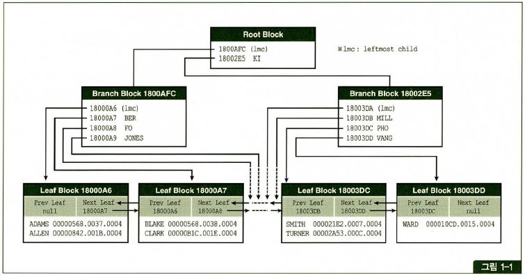
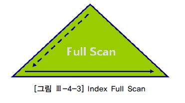
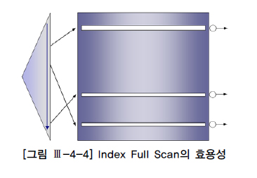
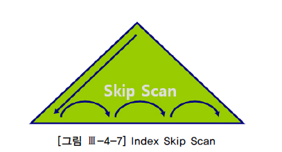
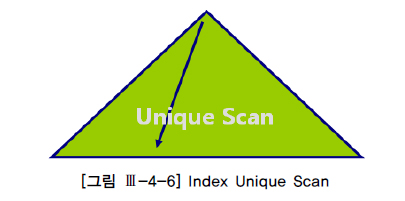

### ROWID

- 오라클에서만 사용 가능하다.
- 데이터의 위치를 말한다.
- 구조
  - 데이터 오브젝트 번호: 테이블 등
  - 데이터 파일 번호
  - 블록 번호
  - 로우 번호


### 인덱스

인덱스는 테이블 컬럼 값과 ROWID를 가지고 있다. 원하는 데이터를 찾을 때 인덱스에서 값을 찾은 후 ROWID를 통해 테이블에 접근한다.



- 인덱스는 블록 구조로 되어 있음
- 브랜치 블록(root block): 하위 블록을 찾기위한 데이터 블록 주소를 가지고 있다.
- 리프 블록: 인덱스 키 칼럼, rowId 포함
- 인덱스가 참조하는 칼럼 값이 모두 NULL 일 경우 레코드를 저장하지 않는다.
- 리프 노드 상 키값과 테이블 레코드 키 값은 서로 일치
- 브랜치 노드 상의 레코드 개수는 하위 레벨 블록 개수와 일치
- 브랜치 노드 상의 키 값은 하위 노드가 갖는 값의 범위를 의미
- 인덱스는 데이터가 정렬되어 들어간다


### 인덱스 구조 및 작동 원리

```sql
SELECT *
FROM employee
WHERE emp_no = 7902;
```

1) 구문파싱 이후 DB Buffer 캐시에 empno가 7902가 있는지 먼저 확인한다.

2) 해당 정보가 캐시에 없으면 디스크 파일에서 7902정보를 가진 블럭을 찾아서 DB Buffer 캐시로 가져온 뒤 해당 정보를 사용자에게 보여줌

Index가 없는 경우 -> 7902 정보가 디스크 어떤 블럭에 있는지 모름으로 10만개 전부 DB Buffer 캐시로 복사한 뒤 Full Scan으로 찾게 됨

Index가 있는 경우 -> Where 절의 조건으로 준 칼럼이 Index의 Key로 생성되어 있는지 확인한 뒤, 인덱스에 먼저 가서 7902정보가 어떤 ROWID를 가지고 있는지 확인한 뒤 해당 ROWID에 있는 블럭만 찾아가서 DB Buffer 캐시에 복사하게 됨.


인덱스 사용할 수 있는 조건

- equal, in, like, between, <=, <, >, >=, not between

인덱스 사용할 수 없는 조건

- not equal, not like, is null, is not null, index supressing

예외사항

- is not null 경우 옵티마이저 판단으로 histogram 이용해 인덱스 사용가능


### Index Unique Scan

- 성능상 가장 빠른 접근 방법
- 인덱스 스캔후 Rowid로 테이블을 액세스 한다.
- Single Block I/O
- Non-Unique Index는 Unique Scan을 할 수 없다.

```sql
SELECT NAME
FROM EMPLOYEES
WHERE EMPLOYEE_ID = 145;
```


### Index Range Scan


- 인덱스 스캔 후 RowId로 테이블을 액세스한다.
- Single Block I/O, Random Access I/OO
  - 과도한 leaf block chain 탐색은 성능에 불리
  - Table에 대한 대량의 Random Access도 성능에 불리
- 정렬된 순서로 데이터를 추출한다. (order by 대신수행)

```sql
SELECT NAME
FROM EMPLOYEES
WHERE JOB_ID = 'IT_PROG'
ORDER BY SALARY;
```


### Index Full Scan



- 인덱스 범위 스캔과 동일 매커니즘
- Leaf Node의 최초 값에서 마지막까지 차례로 읽는다
- 힌트로 제어할 수 없음
- Table Full Scan보다 적은 Index에서 필터시 유용




### Fast Full Index Scan

- 질의에 필요한 모든 컬럼이 인덱스에 포함된 경우
- Multi Block I/O 병렬화
- Index Full Scan 보다 빠름


### Index Skip Scan



- Index Key의 선행 컬럼이 조건절에 없는 경우에 사용
- 선행 컬럼의 Distinct Count가 낮을때만 사용이 권장
- Index Range Scan 보다는 거의 비효율적


### Index Scan



- 인덱스를 경유해서 테이블을 랜덤 액세스한다
- 인덱스의 데이터는 정렬되어 있음
- 인덱스의 rowId를 이용해서 테이블의 실제 row를 랜덤 액세스한다
- single block I/O 액세스


### Index Join

- 각각 Index Scan하여 Hash Join을 이용해서 Join
- 그 결과를 Temporary Object에 저장한다


### Full Table Scan

- 테이블 전체를 액세스
- 원하는 데이터를 찾기 위해 끝까지 읽어야 함
- multi block I/O 액세스


### B*Tree Index

B는 Balanced를 말함

Index를 bit단위로 저장하여 대량의 자료 조회에 적합

분포도가 낮은 칼럼 값에 대한 조회 시 B-Tree 인덱스보다 성능 우수

키값 + start rowid + end rowid + bitmap 구성 > 여러 개의 row를 표현


OLTP(OnLine Transaction Processing): 대부분 인덱스를 태워 부분범위 처리를 유도해야 함

OLAP(OnLine Analytical Processing): 대용량 범위 스캔일 경우에는 FTS가 유리


